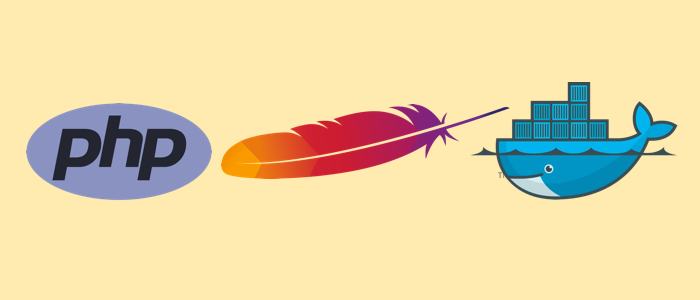

V tomto článku si zprovozníme webový server Apache s PHP. Později se dostaneme také k automatické instalaci závislostí.

Než s článkem začnete, ujistěte se, že máte splněny předpoklady – víte co je to Docker, máte povědomí o tom, jak funguje, k čemu je dobrý a znáte PHP s Apache.

## Předpoklady
- [Co je to Docker](https://www.docker.com/what-docker)
- [Instalace Dockeru](https://docs.docker.com/install/)
- [Základní pojmy a principy Dockeru](https://docs.docker.com/get-started/)
- [Co je to Apache](https://cs.wikipedia.org/wiki/Apache_HTTP_Server)
- [Co je to PHP](http://php.net/)
- [Composer - dependency management](https://getcomposer.org/doc/00-intro.md#dependency-management)


## Manuální instalace bez Dockeru

Představte si, že instalujete Apache a PHP na svém počítači. Při instalaci musíte provést řadu kroků:

1. stáhnout Apache a nainstalovat jej
2. stáhnout potřebnou verzi PHP
3. stáhnout moduly pro Apache
4. nakonfigurovat apache
5. spustit apache

Kdybyste se rozhodli zprovoznit to samé na nějakém dalším počítači (např. u vašeho kamaráda, v práci), budete muset tyto kroky opakovat.

## Zprovoznění s Dockerem

Docker nám umožňuje zabalit náš program jako samostatný `image`, který obsahuje veškeré závislosti, prostředí a knihovny, potřebné pro běh programu.
Abychom mohli takový image vytvořit, musíme nejdříve popsat všechny závislosti. Tyto závislosti popisujeme v souboru, který se nazývá `Dockerfile`.

Dockerfile je v podstatě soubor, do kterého zapíšeme jednotlivé kroky, které bychom jinak dělali manuálně. Můžete ho vnímat jako jakousi kuchařku.
Při vytváření `image` se Docker podívá do našeho Dockerfilu a tyto provede jednotlivé kroky.

Dockerfile nám umožňuje také navazovat na již vytvořený image (tzn. baseimage). Veřejný image nelazneme na [Docker Hubu](https://hub.docker.com/).
Řada z nich je oficiálně spravována vývojáři Dockeru.

Na image můžeme v Dockerfile navázat pomocí příkazu `FROM [nazev:verze]`. Všiměte si, že můžeme specifikovat konkrétní verzi image.

Pro náš projekt využijeme následující image:

- [php:7.2.1-apache](https://hub.docker.com/_/php/)
- [composer:php7](https://hub.docker.com/_/composer/)


##  Vytvoření základního projektu

Vytvoříme si složku `php-apache-example`.

### PHP projekt

- Ve vytvořené složce vytvoříme složku `html` a v ní soubor `index.php`.
- Pro testovací účely vložíme do `index.php` následující kód:
```
<?php
phpinfo();
```
Pomocí tohoto vypíšeme veškeré informace o instalaci PHP a nastavení Apache. Viz [dokumentace phpinfo()](http://php.net/manual/en/function.phpinfo.php).

Základní struktura projektu bude:
```
.
├── html
│   └── index.php
└── Dockerfile
```


### Konfigurace Dockerfile

- Dále vytvoříme Dockerfile, který se jmenuje `Dockerfile` (bez přípony).
- Pro instalaci Apache s PHP využijeme baseimage `php:7.2.1-apache` pomocí příkazu `FROM`.

```
FROM php:7.2.1-apache as apache
```

Apache defaultně předpokládá, že se náš web (vstupní soubor) nachází ve složce `/var/www/html`.
Pomocí následujících příkazů vytvoříme v imagi složku `/var/www` a nastavíme ji jako working directory pro další příkazy.

```
# vytvorime adresar
RUN mkdir -p /var/www
WORKDIR /var/www/
```

Potřebujeme do image dostat náš php kód: `app/index.php`. Pomocí příkazu `COPY` můžeme vzít naši lokální složku `html` a vložit ji do `/var/www` uvnitř containeru/image.

Příkaz COPY má následující parametry: `COPY <src>... <dest>`. Příkaz tedy použijeme následovně:

```
COPY html ./www/
```

Dále restartujeme apache a informujeme Docker o portu, na kterém poběží naše služba:

```
# restartujeme apache
RUN apache2ctl restart

# apache defaultne nasloucha na portu 80
EXPOSE 80
```

### Náš základní Dockerfile tedy bude vypadat takto:

```
FROM php:7.2.1-apache as apache

# vytvorime adresar
RUN mkdir -p /var/www
WORKDIR /var/www/

COPY html ./www/

RUN apache2ctl restart

# apache defaultne nasloucha na portu 80
EXPOSE 80

```

## Build (Vytvoření Image)

Pro vytvoření image přejdeme do složky našeho projektu a zavoláme příkaz:

```
docker build -t <NAZEV IMAGE> .
```

## Run (Spuštění Image)

Pro spuštění již vytvořeného image zavoláme následující příkaz:

```
docker run -p 80:80 <NAZEV IMAGE>
```

Službu bychom nyní měli najít na adrese `localhost:80`.

## Další užitečné příkazy

- `docker ps` List běžících containerů
- `docker stop <ID CONTAINERU>` Vypne běžící container.
- `docker ps` -a List všech containerů
- `docker ps -a -q` List IDs všech containerů
- `docker exec <CONTAINER> <PŘÍKAZ>` Zavolá příkaz v containeru

# Závěr
Ukázali jsme si, jak vytvořit základní službu s PHP a Apache. Nyní jsme schopní jednoduše spustit Apache na jakémkoliv počítači.

V navazujícím článku využijeme možnosti vícefázového buildování a PHP dependency manager - Composer.