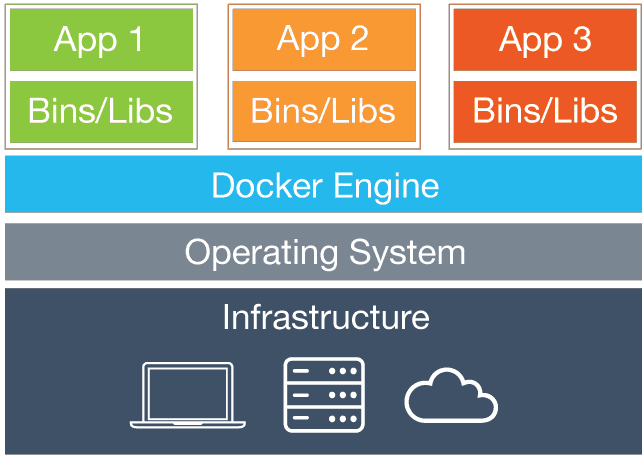

Článek představuje základní pojmy, se kterými se běžně příjdete do styku, když pracujete s Dockerem.

## Image
Image je otisk souborového systému, resp. jeho částí nezbytných pro běh vybrané aplikace. Každá image vychází z tzv. *base image*, která oproti nové image neobsahuje požadované funkce (např. Apache server) nebo soubory.

## Kontejner
Kontejnerem nazýváme spuštěnou image. V podstatě se jedná o omezenou formu virtualizace, kdy není emulován hardware. Kontejner a hostující systém spolu sdílejí jádro operačního systému přičemž je aplikace běžící v kontejneru izolována od systému, který využívá.

Kontejnery mají oproti virtuálním strojům menší nároky na hardware a výrazně rychleji startují. Předpokládá se, že co jedna aplikace nebo služba, to jeden kontejner.

## Dockerfile
Jedná se o textový soubor určující podobu image, kdy každý řádek představuje jeden příkaz.
Jedná se o textový soubor s instrukcemi pro vybuildění kontejneru z image.

Jednoduchý Dockerfile může vypadat třeba takto:
```
FROM: php:7.2.5-apache
COPY: src/ var/www/html
EXPOSE: 80
```

- *FROM* určuje base image, ze které vycházíme.
- *COPY* říká jaké soubory chceme odkud kam zkopírovat.
- *EXPOSE* určuje porty, na kterých má kontejner naslouchat.

## Volume
Image je otisk souborového systému, resp. jeho částí nezbytných pro běh vybrané aplikace. Každá image vychází z tzv. *base image*, která oproti nové image neobsahuje požadované funkce (např. Apache server) nebo soubory.

## Networking
Ve výchozím stavu je síťová komunikace obousměrně zakázaná nejen z kontejneru na hostující systém, ale i mezi běžícími kontejnery. Chceme-li aby bylo možné pracovat s kontejnerem na úrovni sítě, je nutné upravit Dockerfile viz. výše.

Kromě otevírání portů je samozřejmě možné definovat i režim připojení do stítě. Pár příkladů níže:

- `bridge`: Režim síťového mostu. Jedná se o výchozí volbu a nemusí se nastavovat.
- `host`: Zcela odstraňuje síťovou izolaci mezi hostem a kontejnerem. Tato volba je možná pouze ve *swarm módu*.
- `macvlan`: Na linkové vrstvě je komunikace směrována přímo do kontejneru namísto hostujícího systému.
- `none`: Kontejner s touto volbou je odpojen od internetu.

## Build
Build je proces, při kterém je z Dockerfile vygenerována image.

Příkaz pro build může vypadat třeba takto:
```
docker build -t jmeno-kontejneru /cesta
```

- `-t jmeno-kontejneru`: Nově vytvořený kontejner se bude jmenovat *jmeno-kontejneru*
- `/cesta`: Sem patří adresář, ve kterém se nachází dockerfile.

## Swarm mód
Umožňuje běh komplexních služeb, které vyžadují běh mnoha kontejnerů na více fyzických počítačích.

## Docker Compose
Docker Compose umožňuje správu na sobě závislých kontejnerů, které dohromady tvoří jeden funkční celek.

Konfigurační soubor se vždy jmenuje `docker-compose.yml` a může vypadat třeba takto:
```
version: '3'

services:
	product-service:
		build: ./product
		volumes:
			- ./product:/usr/src/app
		ports:
			- 5001:80

	website:
		image: php:apache	
		volumes:
			- ./website:/var/www/html
		ports:
			- 5000:80
		depends_on:
			- product-service
```
Vysvětlení:

- `volumes`: Propojení souborových systémů hostujícího systému a kontejneru.
- `ports`: *port na kterém naslouchá hostující systém* ***:*** *port na kterém naslouchá kontejner*
- `depends_on`: Takto označený kontejner se nespustí pokud neběží uvedený kontejner. V našem případě je tedy spuštění *website* podmíněno běžícím *product-service*.

## Docker Hub
Docker Hub se nachází na adrese [hub.docker.com](https://hub.docker.com/). Jedná se o repozitář s docker images, které je možní stáhnout a používat. Po registraci je možné založit si vlastní repozitář.
